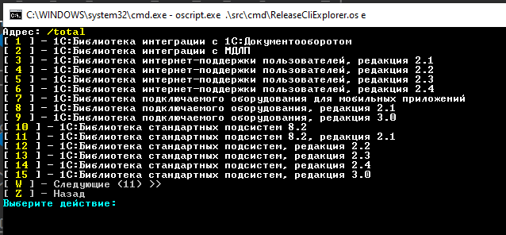
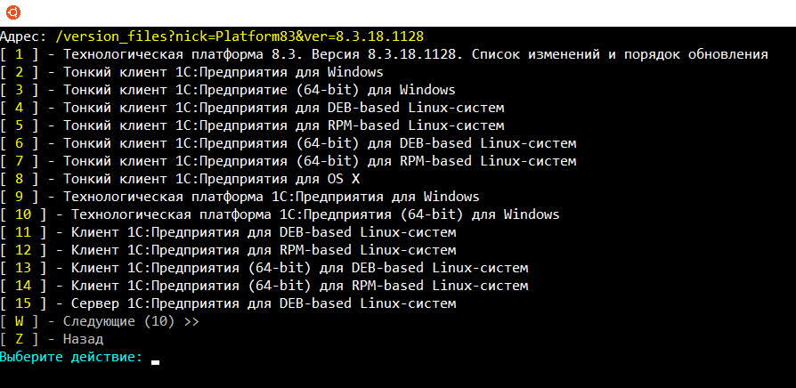

# Консольная утилита для обзора и скачивания с сайта releases.1c.ru

Запускается командой: `releasecliexplorer.bat`(windows) или `releasecliexplorer`(linux)

Основана на библиотеке CLI.

Реализованы две команды:
- обзор сайта (навигация по продуктам, релизам, скачивание)
- скачивание (по прямой ссылке или по ссылке на дистрибутив)

Реализован цветной интерфейс.

\> [Примеры вывода справки](doc/console2.md)
# Планы развития

- Добавить вывод свежих резиов за N дней, вывод тестовых релизов
- Добавить скачивание "последнего релиза"

---

*PS: Приложение писалось в основном для тренировки и повышения навыков. Но скачивать на облачных машинах по быстрому интернету релизы (при медленном локальном канале) тоже очень помогает ;)*